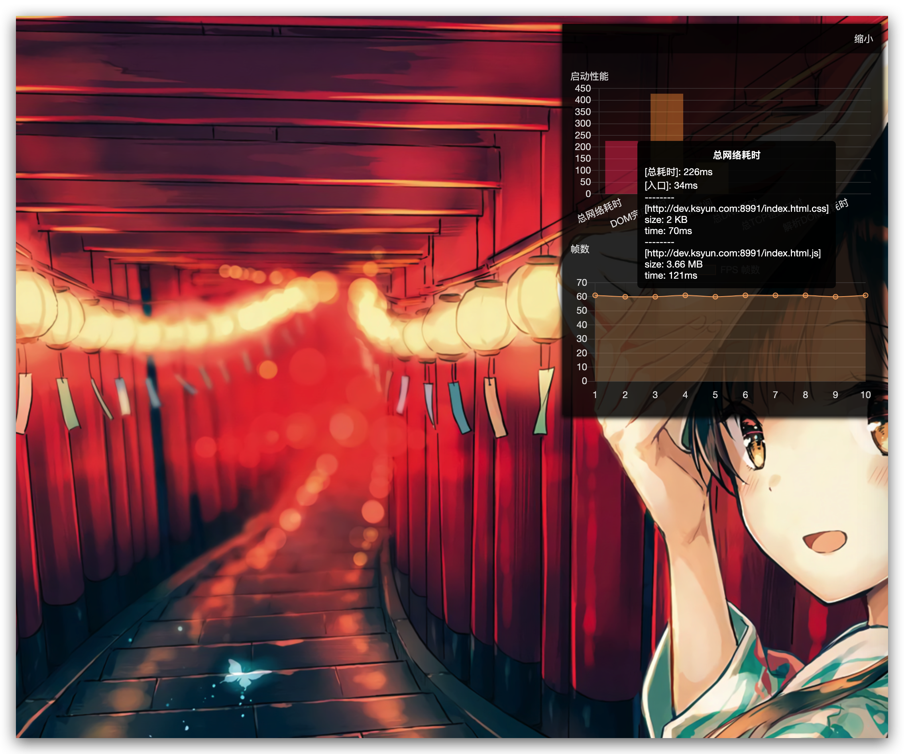

# MT
> monitor frontend & error report
> support plugin

# install
```bash
# ing...
```

### usage
```ts
import Mt from 'mt'
import MtPanel from 'mt/dist/mt-panel'
import MtFps from 'mt/dist/mt-fps'
import MtError from 'mt/dist/mt-error'

let monitor = new Mt({
  //  relate product
  product: 'test',
  //  relate user
  uid: 'test',
  // report url , will stop report if empty | undefined
  reportUrl: `http://${location.hostname}:8000/log`
})

let fps = new MtFps()
let err = new MtError(100000, 100, 10)
let panel = new MtPanel(fps)

monitor
  .plugin(fps)
  .plugin(err)
  .plugin(panel)

monitor.run()
```

### main 
> Collect Performance Data

  - data struct **IPerformance**
  ```ts
  export interface INetworkPerformance {
    // dns 耗时
    dnstime: number
    // tcp链路消耗时间
    tcptracetime: number
    // request 请求时间从服务器到浏览器时间
    requesttime: number
    // response request 结果内容加载时间
    responsetime: number
    // 总体网络耗时
    allnetworktime: number
    // 跳转耗时
    redirect: number
  }
  export interface IPerformance extends INetworkPerformance {
    // 解析dom树消耗时间
    domcompiletime: number
    // 完全白屏时间
    whitetime: number
    // dom树ready的时间
    domreadytime: number
    // onload 的时间
    onloadtime: number
    // cache 耗时
    appcachetime: number
    // 重定向次数
    redirectCount?: number
    // 静态资源性能
    entries: IPerformanceEntry[]
    // 原始新能指标对象
    timing: PerformanceTiming
  }

  export interface IPerformanceEntry extends INetworkPerformance {
    size: number
    name: string
    // 原始性能指标
    timing: PerformanceEntry
  }
  ```


### plugin fps
> timing collect fps data & report server **reportUrl** must be set

### plugin error
> hijack error log & report server **reportUrl** must be set

### plugin panel
> show frontend monitor data dialog panel
> 
> **need import 'mt/dist/mt-panel.css'**



### TODO

- [ ] webpack plugin support auto mounted frontend entry
- [ ] report data compress
- [ ] unit test
- [ ] server platform support analyze report data & alarm
